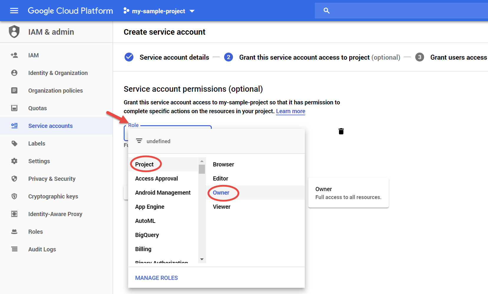

1. For sake of simplicity add a **Project/Owner** role. For more granular permissions configuration follow the guide [here](https://docs.berlioz.cloud/cloud/gcp/account-setup/permissions/).
2. Click **CONTINUE**

