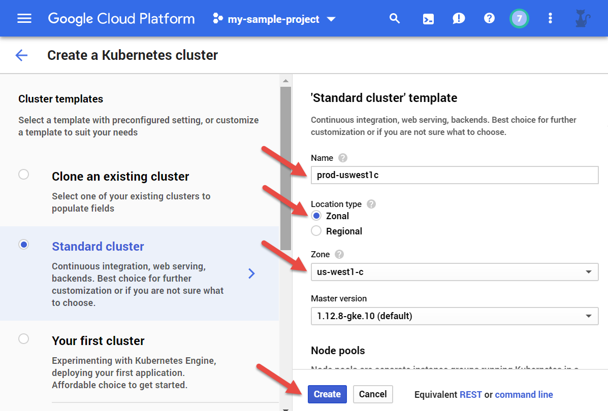

1. Select **Zonal** location type
2. Choose the zone of your choice, for example **us-west1-c**
3. **IMPORTANT:** Name the Kubernetes cluter as following: **&lt;deployment&gt;-&lt;zone-no-dashes&gt;**, for example **prod-uswest1c**
4. Click **Create**

