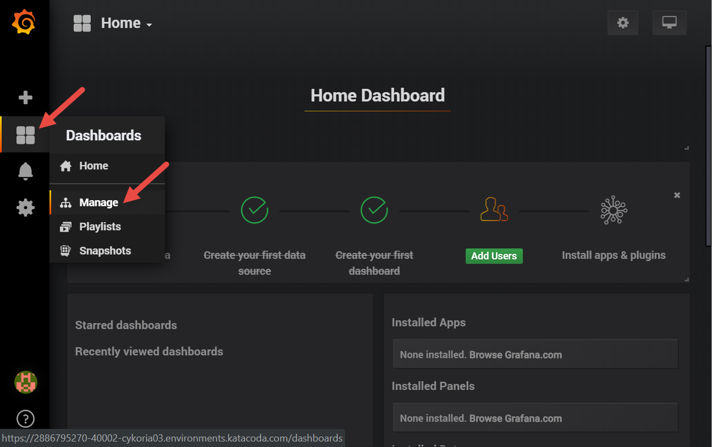
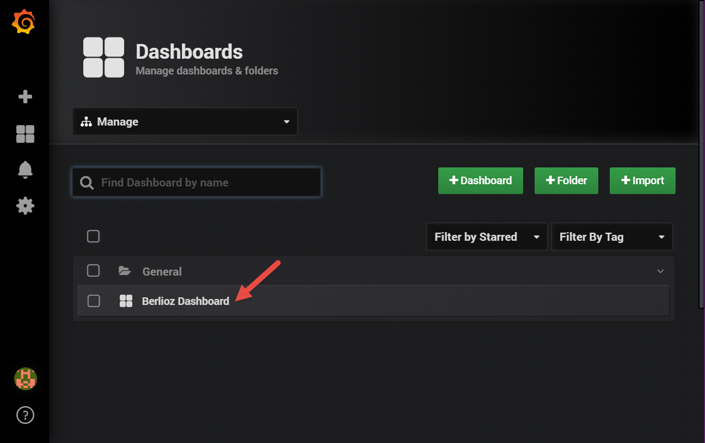
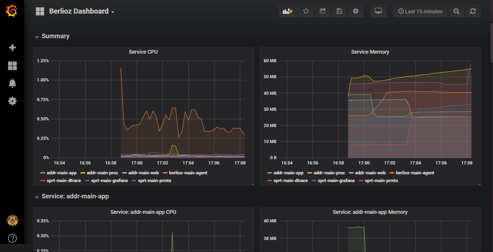

Grafana is accessible from here: https://[[HOST_SUBDOMAIN]]-40002-[[KATACODA_HOST]].environments.katacoda.com/

Login to Grafana using **admin** / **admin** username & password combination. 

Go to *Dasbhoards* -> *Manage*:

Select **Berlioz Dashboard**:

See Metrics

