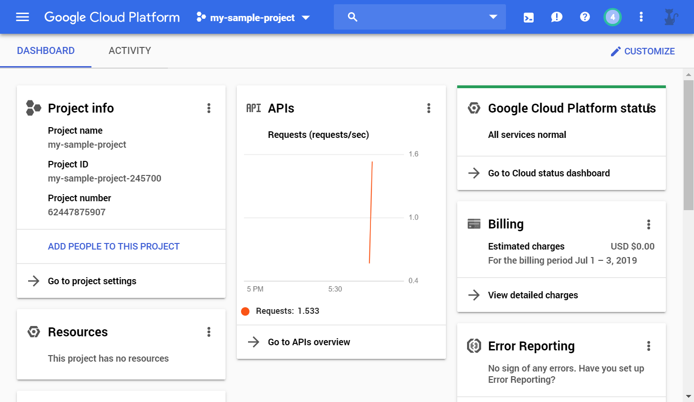

1. Login to [Google Cloud Platform Console](https://console.cloud.google.com). Choose an existing Project, or create a new one.

2. Open **IAM & admin**

3. Navitate to **Service accounts** no the left.

3. Click **+ CREATE SERVICE ACCOUNT**

4. Type Service account name: **berlioz-local**